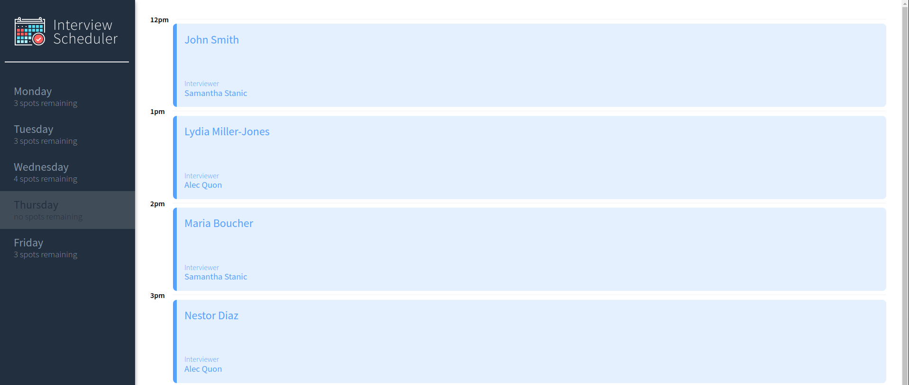

# Interview Scheduler

Interview Scheduler is a SPA (Single Page Application) for tracking student interviews.

## Project brief

 Scheduler is built using React and utilizes React features such as built-in and custom hooks;
 Data is managed by an API server using a PostgreSQL database. The client application communicates with the API server over HTTP using axios.
 Individual Components are tested in isolation using StoryBook as well as End-to-End testing is performed using JEST.

## Setup

- Install dependencies with `npm install`.
- Setup API server: visit https://github.com/lighthouse-labs/scheduler-api and follow instructions in the README.
- Run the api server with `npm start`. launch http://localhost:8001/ to access api server
- Start the app with `npm start` after starting api server; app automatically launches at http://localhost:8000/
  (this app is designed to work with node v10.16.1 and later; use to nvm use 10.16.1 if the app fails to start due to version error)

## Project Stack

- Front-End: React, Axios, JSX, HTML, SASS, JavaScript
- Back-End: Express, Node.js, PostgreSQL
- Testing: Storybook, Webpack Dev Server, Jest, Testing Library and Cypress

## Dependencies

- react
- react-dom
- react-scripts
- axios
- Storybook
- classnames
- normalise.css

## Running Webpack Development Server

```sh
npm start
```
## Running Jest Test Framework

```sh
npm test
```
## Running Storybook Visual Testbed

```sh
npm run storybook
```

## Screenshots




